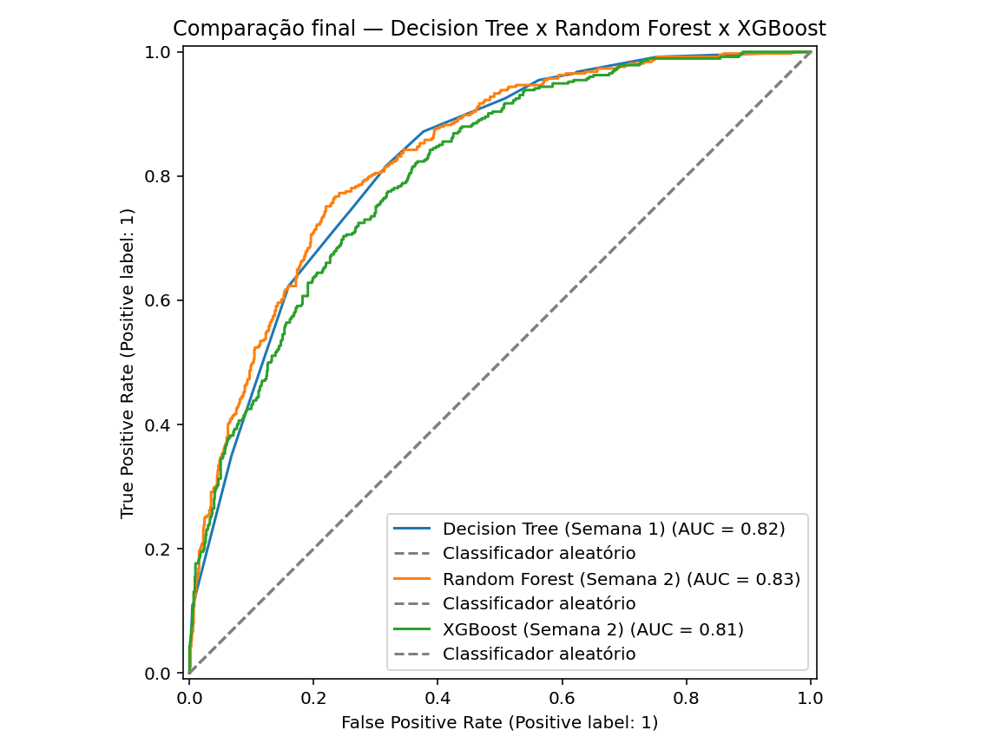
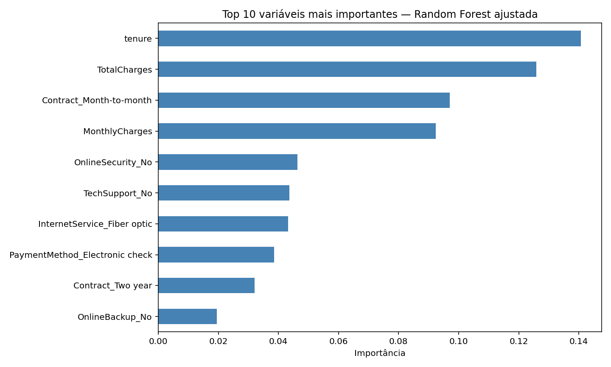

# Previsão de Churn de Clientes: de Árvore de Decisão a Ensemble

Projeto de duas semanas mostrando a evolução de um modelo simples (Decision Tree) até um
ensemble ajustado (Random Forest e XGBoost) para prever cancelamento de clientes (churn),
com foco em recall da classe minoritária.

## Problema

Empresas de assinatura (como operadoras de telecomunicações) perdem receita quando clientes
cancelam o serviço ("churn"). Identificar antecipadamente quem está propenso a cancelar
permite ações de retenção direcionadas. Neste projeto, priorizei o **recall** da classe
"cancelou" como métrica principal: em churn, o custo de não identificar um cliente que vai
sair costuma ser maior que o custo de uma ação de retenção desnecessária em quem ficaria de
qualquer forma.

## Dataset

Telco Customer Churn (IBM sample) — 7.043 clientes, variáveis demográficas, de contrato e de
uso de serviço. Target binário: `Churn` (Yes/No).
Fonte: https://raw.githubusercontent.com/pplonski/datasets-for-start/refs/heads/master/telco-customer-churn/Telco-Customer-Churn.csv

## Metodologia

**Semana 1 — Fundamentos de Árvore de Decisão**
1. Primeira árvore de classificação (baseline sem limite de profundidade)
2. Métricas de classificação completas (precisão, recall, F1, matriz de confusão, ROC)
3. Árvore de regressão em outro dataset (para praticar MAE/MSE/RMSE/R²)
4. Poda manual e tuning de hiperparâmetros com GridSearchCV
5. Validação cruzada K-fold e consolidação da linha de base

**Semana 2 — Métodos de Ensemble**
6. Random Forest (bagging)
7. Tuning do Random Forest (GridSearchCV, otimizando para recall) e importância de variáveis
8. XGBoost (boosting)
9. Stacking combinando os três modelos anteriores
10. Comparação final entre todos os modelos

## Resultados

| Modelo | Accuracy | Precision | Recall | F1 | ROC AUC |
|---|---|---|---|---|---|
| Decision Tree (Semana 1) | 0.780 | 0.618 | 0.449 | 0.520 | 0.824 |
| Random Forest (Semana 2) | 0.792 | 0.640 | 0.500 | 0.562 | 0.832 |
| XGBoost (Semana 2) | 0.768 | 0.569 | 0.527 | 0.547 | 0.808 |

Também testei um **Stacking** combinando os três modelos acima com um meta-modelo de
Regressão Logística: o recall obtido (47.86%) ficou abaixo do XGBoost isolado (52.67%),
indicando que a complexidade extra não se justificou neste caso — os três modelos base, por
serem todos fundamentados em árvores de decisão, tendem a errar nos mesmos clientes, deixando
pouco espaço para o meta-modelo agregar informação nova.

## Conclusão

O **Random Forest** apresentou o melhor equilíbrio geral (maior F1 e ROC AUC entre os três),
mas o **XGBoost** teve o maior recall (0.527), identificando proporcionalmente mais clientes
que realmente cancelam — a métrica que mais importa para este problema de negócio. A evolução
de Decision Tree para os modelos de ensemble trouxe ganho real, especialmente em recall e ROC
AUC, confirmando que combinar múltiplas árvores reduz a variância de um modelo único. Para uma
aplicação de retenção de clientes, recomendo o **XGBoost**, aceitando uma leve queda de
acurácia geral em troca de identificar mais clientes em risco de cancelamento.

## Como rodar

Este projeto foi desenvolvido no Spyder, mas roda em qualquer ambiente Python padrão:

\`\`\`bash
pip install -r requirements.txt
python src/01_primeira_arvore.py
# ... siga a ordem numérica dos arquivos em src/
\`\`\`

Se preferir reabrir no Spyder, basta abrir a pasta do projeto e definir `ensemble-churn-project`
como diretório de trabalho antes de rodar qualquer arquivo.

